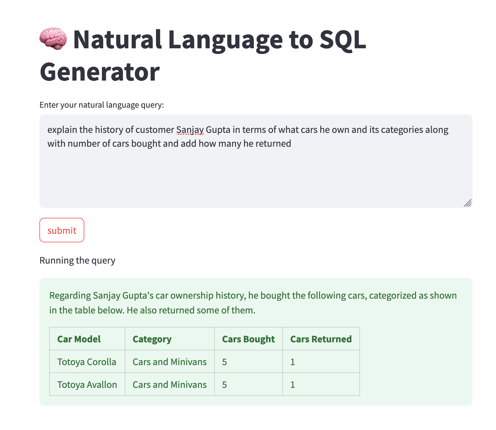

# 🔍 Natural Language to SQL Generator agent

## Components overview
- **Frontend:** Streamlit
- **NLQ to SQL converter ( AI Agent ):** 
    - Experiement with some lite models ( gemini/gemini-2.0-flash-lite )
- **SQL validator:** Prevents SQl injection or malformed queries.
- **💾 Multi-Database Support (MySQL, PostgreSQL, Oracle)**
    - Run the SQL query and get the results.
- **Logging / Monitoring:** Log query and response with result for debugging.
- **Evalution:** Evaluate the result
    - Result Accuracy - check the sql executed result.
    - Logical SQL comparision - **Not a good idea** because query can be written in multiple ways.
    - LLM/ Human feedback - Try to implement the feedback loop like chatGPT has thumbsup/down symbols.

## sample screenshots

